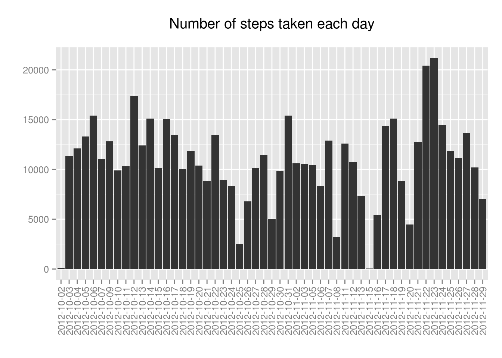
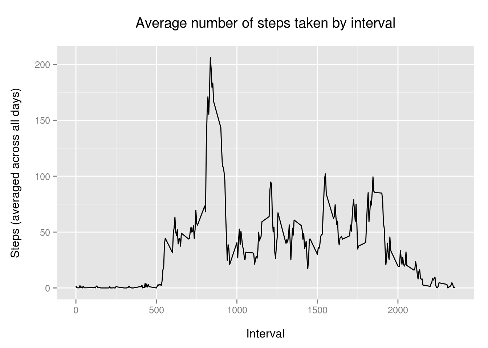
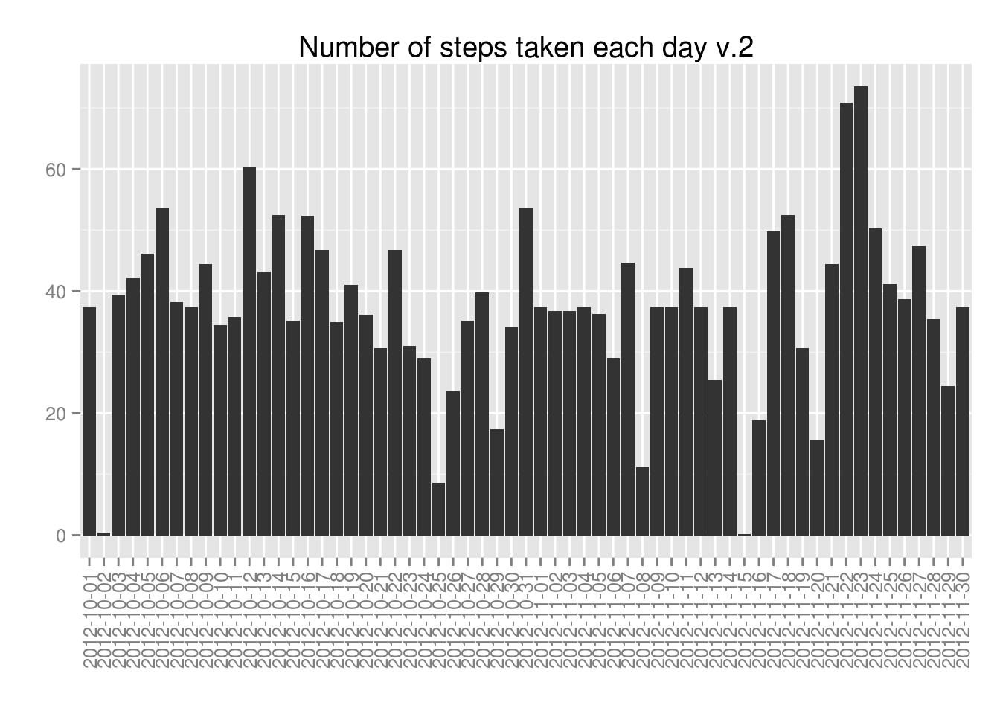

```r
library(knitr)
opts_chunk$set(fig.path = "./figures/") # Set figures path
```

---

### Introduction  

> The data for this assignment can be downloaded from the course web site:

> Dataset: [Activity monitoring data](https://d396qusza40orc.cloudfront.net/repdata%2Fdata%2Factivity.zip)

> This [assignment](https://class.coursera.org/repdata-008/human_grading/view/courses/972599/assessments/3/submissions) makes use of data from a personal activity monitoring device. This device collects data at 5 minute intervals through out the day. The data consists of two months of data from an anonymous individual collected during the months of October and November, 2012 and include the number of steps taken in 5 minute intervals each day.

> The variables included in this dataset are:

> - **steps**: Number of steps taking in a 5-minute interval (missing values are coded as NA)
- **date**: The date on which the measurement was taken in YYYY-MM-DD format
- **interval**: Identifier for the 5-minute interval in which measurement was taken

> The dataset is stored in a comma-separated-value (CSV) file and there are a total of 17,568 observations in this dataset.

---

### Loading and preprocessing the data

#### Setting the working directory


```r
act.dir<-"/home/gaelle/practicas/Coursera_Data_Science/Assessments/Reproducible_Research/"
```

#### Loading the data


```r
act.path<-file.path(act.dir, "activity.csv")
act<-read.csv(act.path, header = T, sep=",")
```

Data overview:


```r
str(act)
```

```
## 'data.frame':	17568 obs. of  3 variables:
##  $ steps   : int  NA NA NA NA NA NA NA NA NA NA ...
##  $ date    : Factor w/ 61 levels "2012-10-01","2012-10-02",..: 1 1 1 1 1 1 1 1 1 1 ...
##  $ interval: int  0 5 10 15 20 25 30 35 40 45 ...
```

```r
head(act)
```

```
##   steps       date interval
## 1    NA 2012-10-01        0
## 2    NA 2012-10-01        5
## 3    NA 2012-10-01       10
## 4    NA 2012-10-01       15
## 5    NA 2012-10-01       20
## 6    NA 2012-10-01       25
```

```r
tail(act)
```

```
##       steps       date interval
## 17563    NA 2012-11-30     2330
## 17564    NA 2012-11-30     2335
## 17565    NA 2012-11-30     2340
## 17566    NA 2012-11-30     2345
## 17567    NA 2012-11-30     2350
## 17568    NA 2012-11-30     2355
```

```r
summary(act)
```

```
##      steps                date          interval     
##  Min.   :  0.00   2012-10-01:  288   Min.   :   0.0  
##  1st Qu.:  0.00   2012-10-02:  288   1st Qu.: 588.8  
##  Median :  0.00   2012-10-03:  288   Median :1177.5  
##  Mean   : 37.38   2012-10-04:  288   Mean   :1177.5  
##  3rd Qu.: 12.00   2012-10-05:  288   3rd Qu.:1766.2  
##  Max.   :806.00   2012-10-06:  288   Max.   :2355.0  
##  NA's   :2304     (Other)   :15840
```

---

### What are the mean and median of the total number of steps taken per day?

> For this part of the assignment, you can ignore the missing values in the dataset.

#### 1. Make a histogram of the total number of steps taken each day


```r
# install.packages("ggplot2")
library(ggplot2)

p1<-ggplot(data = na.omit(act),aes(x=date,y=steps))+
    geom_histogram(stat="summary",fun.y="sum")+
    labs(title="Number of steps taken each day\n",y="",x="")+
    theme(axis.text.x=element_text(angle = 90, vjust = 0.5))

p1
```

 

#### 2. Calculate and report the **mean** and **median** total number of steps taken per day


```r
# install.packages("doBy")
library(doBy)

sum1<-summaryBy(formula = steps~date,data = na.omit(act),
                FUN = function(x) { c(mean = round(mean(x),2), median = median(x)) } )

sum1
```

```
##          date steps.mean steps.median
## 1  2012-10-02       0.44            0
## 2  2012-10-03      39.42            0
## 3  2012-10-04      42.07            0
## 4  2012-10-05      46.16            0
## 5  2012-10-06      53.54            0
## 6  2012-10-07      38.25            0
## 7  2012-10-09      44.48            0
## 8  2012-10-10      34.38            0
## 9  2012-10-11      35.78            0
## 10 2012-10-12      60.35            0
## 11 2012-10-13      43.15            0
## 12 2012-10-14      52.42            0
## 13 2012-10-15      35.20            0
## 14 2012-10-16      52.38            0
## 15 2012-10-17      46.71            0
## 16 2012-10-18      34.92            0
## 17 2012-10-19      41.07            0
## 18 2012-10-20      36.09            0
## 19 2012-10-21      30.63            0
## 20 2012-10-22      46.74            0
## 21 2012-10-23      30.97            0
## 22 2012-10-24      29.01            0
## 23 2012-10-25       8.65            0
## 24 2012-10-26      23.53            0
## 25 2012-10-27      35.14            0
## 26 2012-10-28      39.78            0
## 27 2012-10-29      17.42            0
## 28 2012-10-30      34.09            0
## 29 2012-10-31      53.52            0
## 30 2012-11-02      36.81            0
## 31 2012-11-03      36.70            0
## 32 2012-11-05      36.25            0
## 33 2012-11-06      28.94            0
## 34 2012-11-07      44.73            0
## 35 2012-11-08      11.18            0
## 36 2012-11-11      43.78            0
## 37 2012-11-12      37.38            0
## 38 2012-11-13      25.47            0
## 39 2012-11-15       0.14            0
## 40 2012-11-16      18.89            0
## 41 2012-11-17      49.79            0
## 42 2012-11-18      52.47            0
## 43 2012-11-19      30.70            0
## 44 2012-11-20      15.53            0
## 45 2012-11-21      44.40            0
## 46 2012-11-22      70.93            0
## 47 2012-11-23      73.59            0
## 48 2012-11-24      50.27            0
## 49 2012-11-25      41.09            0
## 50 2012-11-26      38.76            0
## 51 2012-11-27      47.38            0
## 52 2012-11-28      35.36            0
## 53 2012-11-29      24.47            0
```

---

### What is the average daily activity pattern?

#### 1. Make a time series plot (i.e. type = "l") of the 5-minute interval (x-axis) and the average number of steps taken, averaged across all days (y-axis)


```r
ggplot(data = act,aes(x=interval,y=steps))+
    geom_line(stat="summary",fun.y="mean")+
    labs(title="Average number of steps taken by interval\n",
         y="Steps (averaged across all days)\n",x="\nInterval")
```

```
## Warning: Removed 2304 rows containing missing values (stat_summary).
```

 

#### 2. Which 5-minute interval, on average across all the days in the dataset, contains the maximum number of steps?


```r
mean.I<-summaryBy(formula = steps~interval,data = na.omit(act),
                       FUN = function(x) { c(mean = round(mean(x),2)) })

head(mean.I)
```

```
##   interval steps.mean
## 1        0       1.72
## 2        5       0.34
## 3       10       0.13
## 4       15       0.15
## 5       20       0.08
## 6       25       2.09
```

```r
tail(mean.I)
```

```
##     interval steps.mean
## 283     2330       2.60
## 284     2335       4.70
## 285     2340       3.30
## 286     2345       0.64
## 287     2350       0.23
## 288     2355       1.08
```

```r
mean.I[mean.I$steps.mean==max(mean.I$steps.mean),]
```

```
##     interval steps.mean
## 104      835     206.17
```

```r
# or:

mean.I[which(mean.I$steps.mean==max(mean.I$steps.mean)),]
```

```
##     interval steps.mean
## 104      835     206.17
```

---

### Imputing missing values

> Note that there are a number of days/intervals where there are missing values (coded as `NA`). The presence of missing days may introduce bias into some calculations or summaries of the data.

#### 1. Calculate and report the total number of missing values in the dataset (i.e. the total number of rows with NAs)


```r
sum(is.na(act))
```

```
## [1] 2304
```

```r
# all missing values are in steps column:
sum(is.na(act$steps))
```

```
## [1] 2304
```

#### 2. Devise a strategy for filling in all of the missing values in the dataset. The strategy does not need to be sophisticated. For example, you could use the mean/median for that day, or the mean for that 5-minute interval, etc.


```r
mean.day<-summaryBy(formula = steps~date,data = act,
                    FUN = function(x) { c(mean = round(mean(x),2)) } )

mean.day
```

```
##          date steps.mean
## 1  2012-10-01         NA
## 2  2012-10-02       0.44
## 3  2012-10-03      39.42
## 4  2012-10-04      42.07
## 5  2012-10-05      46.16
## 6  2012-10-06      53.54
## 7  2012-10-07      38.25
## 8  2012-10-08         NA
## 9  2012-10-09      44.48
## 10 2012-10-10      34.38
## 11 2012-10-11      35.78
## 12 2012-10-12      60.35
## 13 2012-10-13      43.15
## 14 2012-10-14      52.42
## 15 2012-10-15      35.20
## 16 2012-10-16      52.38
## 17 2012-10-17      46.71
## 18 2012-10-18      34.92
## 19 2012-10-19      41.07
## 20 2012-10-20      36.09
## 21 2012-10-21      30.63
## 22 2012-10-22      46.74
## 23 2012-10-23      30.97
## 24 2012-10-24      29.01
## 25 2012-10-25       8.65
## 26 2012-10-26      23.53
## 27 2012-10-27      35.14
## 28 2012-10-28      39.78
## 29 2012-10-29      17.42
## 30 2012-10-30      34.09
## 31 2012-10-31      53.52
## 32 2012-11-01         NA
## 33 2012-11-02      36.81
## 34 2012-11-03      36.70
## 35 2012-11-04         NA
## 36 2012-11-05      36.25
## 37 2012-11-06      28.94
## 38 2012-11-07      44.73
## 39 2012-11-08      11.18
## 40 2012-11-09         NA
## 41 2012-11-10         NA
## 42 2012-11-11      43.78
## 43 2012-11-12      37.38
## 44 2012-11-13      25.47
## 45 2012-11-14         NA
## 46 2012-11-15       0.14
## 47 2012-11-16      18.89
## 48 2012-11-17      49.79
## 49 2012-11-18      52.47
## 50 2012-11-19      30.70
## 51 2012-11-20      15.53
## 52 2012-11-21      44.40
## 53 2012-11-22      70.93
## 54 2012-11-23      73.59
## 55 2012-11-24      50.27
## 56 2012-11-25      41.09
## 57 2012-11-26      38.76
## 58 2012-11-27      47.38
## 59 2012-11-28      35.36
## 60 2012-11-29      24.47
## 61 2012-11-30         NA
```

Since the days that have missing values have `NA`s for all intervals, we can't use the mean of that day, so I used the mean for the corresponding 5-minute interval


```r
head(act); head(mean.I)
```

```
##   steps       date interval
## 1    NA 2012-10-01        0
## 2    NA 2012-10-01        5
## 3    NA 2012-10-01       10
## 4    NA 2012-10-01       15
## 5    NA 2012-10-01       20
## 6    NA 2012-10-01       25
```

```
##   interval steps.mean
## 1        0       1.72
## 2        5       0.34
## 3       10       0.13
## 4       15       0.15
## 5       20       0.08
## 6       25       2.09
```

```r
# merging of both data frames so each value is on the same row that its corresponding mean:
act.mean.I<-merge(act,mean.I,by.x = "interval") 

# after merging the new df is ordered by interval:
head(act.mean.I)
```

```
##   interval steps       date steps.mean
## 1        0    NA 2012-10-01       1.72
## 2        0     0 2012-11-23       1.72
## 3        0     0 2012-10-28       1.72
## 4        0     0 2012-11-06       1.72
## 5        0     0 2012-11-24       1.72
## 6        0     0 2012-11-15       1.72
```

```r
# re-order by date:
act.mean.I<-act.mean.I[order(act.mean.I[,3]),]

head(act.mean.I)
```

```
##     interval steps       date steps.mean
## 1          0    NA 2012-10-01       1.72
## 63         5    NA 2012-10-01       0.34
## 128       10    NA 2012-10-01       0.13
## 205       15    NA 2012-10-01       0.15
## 264       20    NA 2012-10-01       0.08
## 327       25    NA 2012-10-01       2.09
```

#### 3. Create a new dataset that is equal to the original dataset but with the missing data filled in.


```r
act2<-act

# replace missing values (`act2` 2nd column) by their corresponding mean (`act.mean.I` 4th column):
for(i in 1:nrow(act2)){
    if (is.na(act2[i,1])){
        act2[i,1]<-act.mean.I[i,4]
    }
}

names(act2)<-c("steps2","date2","interval2")

head(act2)
```

```
##   steps2      date2 interval2
## 1   1.72 2012-10-01         0
## 2   0.34 2012-10-01         5
## 3   0.13 2012-10-01        10
## 4   0.15 2012-10-01        15
## 5   0.08 2012-10-01        20
## 6   2.09 2012-10-01        25
```

#### 4. Make a histogram of the total number of steps taken each day and Calculate and report the mean and median total number of steps taken per day. Do these values differ from the estimates from the first part of the assignment? What is the impact of imputing missing data on the estimates of the total daily number of steps?


```r
sum2<-summaryBy(formula = steps2~date2,data = act2,
                FUN = function(x) { c(mean = round(mean(x),2), median = median(x)) } )

sum2
```

```
##         date2 steps2.mean steps2.median
## 1  2012-10-01       37.38        34.115
## 2  2012-10-02        0.44         0.000
## 3  2012-10-03       39.42         0.000
## 4  2012-10-04       42.07         0.000
## 5  2012-10-05       46.16         0.000
## 6  2012-10-06       53.54         0.000
## 7  2012-10-07       38.25         0.000
## 8  2012-10-08       37.38        34.115
## 9  2012-10-09       44.48         0.000
## 10 2012-10-10       34.38         0.000
## 11 2012-10-11       35.78         0.000
## 12 2012-10-12       60.35         0.000
## 13 2012-10-13       43.15         0.000
## 14 2012-10-14       52.42         0.000
## 15 2012-10-15       35.20         0.000
## 16 2012-10-16       52.38         0.000
## 17 2012-10-17       46.71         0.000
## 18 2012-10-18       34.92         0.000
## 19 2012-10-19       41.07         0.000
## 20 2012-10-20       36.09         0.000
## 21 2012-10-21       30.63         0.000
## 22 2012-10-22       46.74         0.000
## 23 2012-10-23       30.97         0.000
## 24 2012-10-24       29.01         0.000
## 25 2012-10-25        8.65         0.000
## 26 2012-10-26       23.53         0.000
## 27 2012-10-27       35.14         0.000
## 28 2012-10-28       39.78         0.000
## 29 2012-10-29       17.42         0.000
## 30 2012-10-30       34.09         0.000
## 31 2012-10-31       53.52         0.000
## 32 2012-11-01       37.38        34.115
## 33 2012-11-02       36.81         0.000
## 34 2012-11-03       36.70         0.000
## 35 2012-11-04       37.38        34.115
## 36 2012-11-05       36.25         0.000
## 37 2012-11-06       28.94         0.000
## 38 2012-11-07       44.73         0.000
## 39 2012-11-08       11.18         0.000
## 40 2012-11-09       37.38        34.115
## 41 2012-11-10       37.38        34.115
## 42 2012-11-11       43.78         0.000
## 43 2012-11-12       37.38         0.000
## 44 2012-11-13       25.47         0.000
## 45 2012-11-14       37.38        34.115
## 46 2012-11-15        0.14         0.000
## 47 2012-11-16       18.89         0.000
## 48 2012-11-17       49.79         0.000
## 49 2012-11-18       52.47         0.000
## 50 2012-11-19       30.70         0.000
## 51 2012-11-20       15.53         0.000
## 52 2012-11-21       44.40         0.000
## 53 2012-11-22       70.93         0.000
## 54 2012-11-23       73.59         0.000
## 55 2012-11-24       50.27         0.000
## 56 2012-11-25       41.09         0.000
## 57 2012-11-26       38.76         0.000
## 58 2012-11-27       47.38         0.000
## 59 2012-11-28       35.36         0.000
## 60 2012-11-29       24.47         0.000
## 61 2012-11-30       37.38        34.115
```

```r
p2<-ggplot(data = sum2,aes(x=date2,y=steps2.mean))+ 
    geom_histogram(stat="identity")+
    labs(title="Number of steps taken each day v.2",y="",x="")+
    theme(axis.text.x=element_text(angle = 90, vjust = 0.5))

p2
```

 

When there are misssing values, they are missing for an entire day, so the impact of imputing missing data is that: a) the mean and the median will be the same for all days with `NA`s; b) the median, which was 0 for all days without missing values, is now close to the mean for the days with missing values.

### Are there differences in activity patterns between weekdays and weekends?

> For this part the `weekdays()` function may be of some help here. Use the dataset with the filled-in missing values for this part.

> 1. Create a new factor variable in the dataset with two levels – “weekday” and “weekend” indicating whether a given date is a weekday or weekend day.


```r
act2.days<-act2

str(act2$date2)
```

```
##  Factor w/ 61 levels "2012-10-01","2012-10-02",..: 1 1 1 1 1 1 1 1 1 1 ...
```

```r
act2.days$date2<-as.Date(x = act2$date2,format = "%Y-%m-%d")

str(act2.days$date2)
```

```
##  Date[1:17568], format: "2012-10-01" "2012-10-01" "2012-10-01" "2012-10-01" ...
```

```r
act2.days<-cbind(act2.days,Weekday=as.factor(weekdays(act2.days$date2)))

head(act2.days)
```

```
##   steps2      date2 interval2 Weekday
## 1   1.72 2012-10-01         0  Monday
## 2   0.34 2012-10-01         5  Monday
## 3   0.13 2012-10-01        10  Monday
## 4   0.15 2012-10-01        15  Monday
## 5   0.08 2012-10-01        20  Monday
## 6   2.09 2012-10-01        25  Monday
```

```r
# levels of factor Weekday:
levels(act2.days$Weekday)
```

```
## [1] "Friday"    "Monday"    "Saturday"  "Sunday"    "Thursday"  "Tuesday"  
## [7] "Wednesday"
```

```r
# re-ordering levels:
act2.days$Weekday<-factor(act2.days$Weekday, 
                          levels = c("Monday","Tuesday","Wednesday","Thursday",
                                     "Friday","Saturday","Sunday"))

levels(act2.days$Weekday)
```

```
## [1] "Monday"    "Tuesday"   "Wednesday" "Thursday"  "Friday"    "Saturday" 
## [7] "Sunday"
```

```r
head(act2.days)
```

```
##   steps2      date2 interval2 Weekday
## 1   1.72 2012-10-01         0  Monday
## 2   0.34 2012-10-01         5  Monday
## 3   0.13 2012-10-01        10  Monday
## 4   0.15 2012-10-01        15  Monday
## 5   0.08 2012-10-01        20  Monday
## 6   2.09 2012-10-01        25  Monday
```


```r
act3<-act2.days
names(act3)<-c("steps3","date3","interval3","Weekday")

head(act3)
```

```
##   steps3      date3 interval3 Weekday
## 1   1.72 2012-10-01         0  Monday
## 2   0.34 2012-10-01         5  Monday
## 3   0.13 2012-10-01        10  Monday
## 4   0.15 2012-10-01        15  Monday
## 5   0.08 2012-10-01        20  Monday
## 6   2.09 2012-10-01        25  Monday
```

```r
# grouping levels:
levels(act3$Weekday)<-c("weekday","weekday","weekday","weekday","weekday",
                        "weekend","weekend")
levels(act3$Weekday)
```

```
## [1] "weekday" "weekend"
```

```r
head(act3)
```

```
##   steps3      date3 interval3 Weekday
## 1   1.72 2012-10-01         0 weekday
## 2   0.34 2012-10-01         5 weekday
## 3   0.13 2012-10-01        10 weekday
## 4   0.15 2012-10-01        15 weekday
## 5   0.08 2012-10-01        20 weekday
## 6   2.09 2012-10-01        25 weekday
```

> 2. Make a panel plot containing a time series plot (i.e. type = "l") of the 5-minute interval (x-axis) and the average number of steps taken, averaged across all weekday days or weekend days (y-axis). See the README file in the GitHub repository to see an example of what this plot should look like using simulated data.


```r
p3.monfry<-ggplot(data = act3[act3$Weekday=="weekday",],aes(x=interval3,y=steps3))+
    geom_line(stat="summary",fun.y="mean")+
    labs(title="Weekdays",y="Steps",x="Interval")

p3.satsun<-ggplot(data = act3[act3$Weekday=="weekend",],aes(x=interval3,y=steps3))+
    geom_line(stat="summary",fun.y="mean")+
    labs(title="Weekends",y="Steps",x="Interval")

library(gridExtra)

grid.arrange(p3.monfry,p3.satsun,main = "Average number of steps taken by interval")
```

 

```r
sessionInfo()
```

```
## R version 3.1.2 (2014-10-31)
## Platform: x86_64-pc-linux-gnu (64-bit)
## 
## locale:
##  [1] LC_CTYPE=en_GB.UTF-8       LC_NUMERIC=C              
##  [3] LC_TIME=en_GB.UTF-8        LC_COLLATE=en_GB.UTF-8    
##  [5] LC_MONETARY=en_GB.UTF-8    LC_MESSAGES=en_GB.UTF-8   
##  [7] LC_PAPER=en_GB.UTF-8       LC_NAME=C                 
##  [9] LC_ADDRESS=C               LC_TELEPHONE=C            
## [11] LC_MEASUREMENT=en_GB.UTF-8 LC_IDENTIFICATION=C       
## 
## attached base packages:
## [1] grid      splines   stats     graphics  grDevices utils     datasets 
## [8] methods   base     
## 
## other attached packages:
## [1] gridExtra_0.9.1 doBy_4.5-11     MASS_7.3-35     survival_2.37-7
## [5] ggplot2_1.0.0   knitr_1.7      
## 
## loaded via a namespace (and not attached):
##  [1] colorspace_1.2-4 digest_0.6.3     evaluate_0.5.5   formatR_1.0     
##  [5] gtable_0.1.2     htmltools_0.2.6  labeling_0.3     lattice_0.20-29 
##  [9] markdown_0.7.4   Matrix_1.1-4     mime_0.2         munsell_0.4.2   
## [13] plyr_1.8.1       proto_0.3-10     Rcpp_0.11.3      reshape2_1.4    
## [17] rmarkdown_0.3.10 scales_0.2.4     stringr_0.6.2    tools_3.1.2     
## [21] yaml_2.1.13
```
